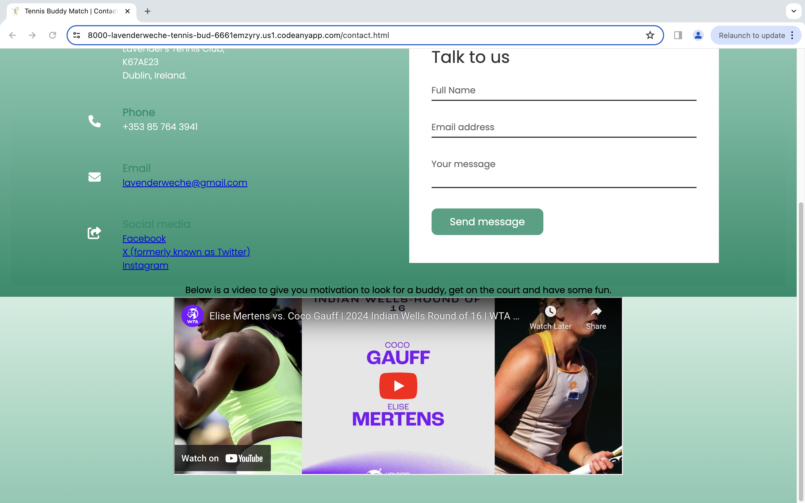

# Tennis Buddy Match Dublin Documentation

Welcome to the documentation for Tennis Buddy Match Dublin - your go-to platform for finding tennis partners and organizing matches in Dublin.

## Overview 
TennisMatch Dublin is a web application designed to connect tennis enthusiasts across Dublin, fostering a vibrant community of players who share a passion for the game. Whether you're a beginner looking to improve your skills or a seasoned pro seeking competitive matches, TennisMatch Dublin has something for everyone.

## Features
1.  **Find Tennis Partners:** Easily search for tennis partners based on skill level, availability, and location.

2. **Organize Matches:** Join organized matches held regularly throughout Dublin, including competitive tournaments and friendly rallies.

3. **Community Engagement:** Connect with like-minded players, share tips and advice, and stay updated on the latest tennis events in Dublin.

4. **User Profiles:** Create a personalized profile to showcase your tennis skills and preferences, making it easier for others to find and connect with you. 

## Installation

To run Tennis Buddy Match Dublin locally, go to the site address which can be visited on:  https://github.com/lavenderweche/tennis-buddy-finder.git

## Encountered bugs/errors and resolutions (just to name a few for now)

- **Missing Closing Tags**: Forgetting to close HTML tags. Resolution: Double-checked the HTML markup for missing closing tags and ensured to close any where the errors appeared. This only happened when I deleted an already closed tag because the tool is helpful in the sense that it closed every tag that I opened but when I deleted it for some reason and forgot to close it back, it would cause an error.

- **CSS Selectors Not Targeting Elements**: Sometimes I would put the wrong "target" for example targetting a ul that is in a different section from the one that I actually wanted to target. Resolution: Reviewed the CSS selectors to ensure they matched the HTML elements to be styled, and used browser developer tools to inspect element styles for debugging. 

- **Responsive Design Problems**: Layout not adapting properly to different screen sizes or devices. Resolution: I had to use the CSS media queries to adjust layout and styling based on viewport size, and test the website on various devices to ensure it displays correctly. The google chrome inspecting tool was also very useful because I got to test the different devices.

- **Image Loading Errors**: This was a huge issue for me, I was always mixing up the file paths then the images were not loading or displaying incorrectly. Resolution: Checked the image file paths and updated them. 

## Contributing
We welcome contributions from the community to improve TennisMatch Dublin. If you have ideas for new features, bug fixes, or enhancements, feel free to open a pull request or submit an issue on our GitHub repository.

## Contact Us 
If you have questions, feedback, or just want to chat tennis? Get in touch with me via [email](mailto:lavenderweche@gmail.com)

Below are some screenshot of how the site currently looks. 
## NB: The site is still a work in progress and will be enhanced as we proceed with the course. In the end, it will look amazing and work so well! For example, there will be a gallery page added and an About Us page which are being worked on. 

![The landing page.]

![The registration page.]

![The contact us page.]

![The contact us page has a short video to motivate players to get on the court and play.]
